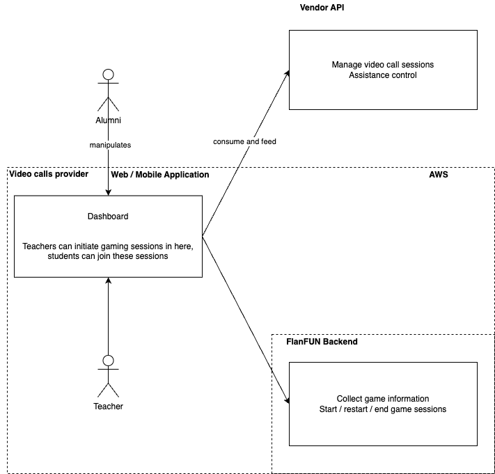

# FlanFUN webgame

[Open: FLANFON.drawio.png](./b2ceca6d42f04fb0c8e19471be6211bd_MD5.png)

---
#### Running the code

**create an .env.development file**
VITE_APP_MP_WEBSOCK=XXXX
VITE_APP_STATIC_URL=XXXX

where:

WEBSOCK = url of the websocket server
STATIC_URL = url where 3D assets can be found

**we use yarn as the main dependency provider**
`yarn install`

**second, simply**
`yarn develop`

---
#### Code organization

**Frameworks**
- NextJS: For Statical Site Generation, thus making page loading faster
- ReactJS: Javascript library for efficient web development

**Main Libraries**
- ThreeJS: Load and render 3d assets from statical servers
- GSAP: Animation library for In-Game transitions / animations
- SocketIO: Communication with server via websockets to achieve near RTC
- Crypto browserify: Access to multiple blockchain utilities

#### /src folder
`assets` : Inherent statical assets relative to the web application interface
`components`: JSX components inherent to the game
`fractable-min`: minimal 3rd party library that allows to load and visualize 3d assets efficiently
`hooks`: Useful hooks
`infra/http infra/wsmp` Calls to server APIs / Websocket communication
`modules`: web utilities that are repeated througout the project
`pages`: NextJs statically rendered pages
`services`: communication with FLAN's APIs
`styles`: universal stylings for web components
`utils`: generic utilities
`web3`: web3 related initializers and non-graphical logic

---
#### Where's the original work located?

Every part of the repository except for the libraries used are part of the original work

---

